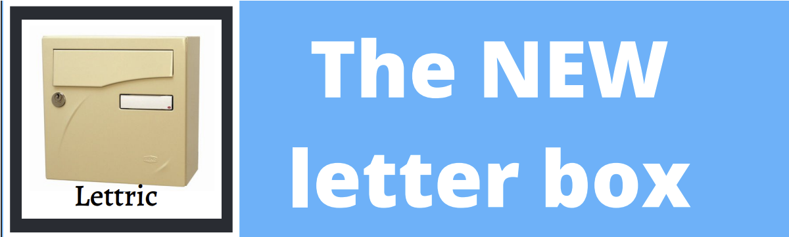
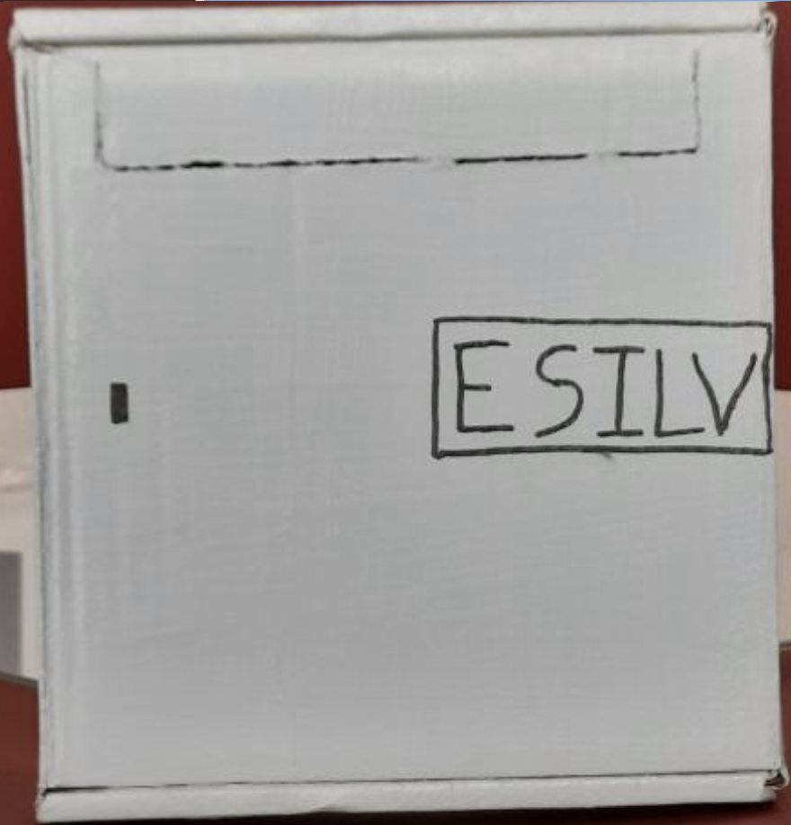
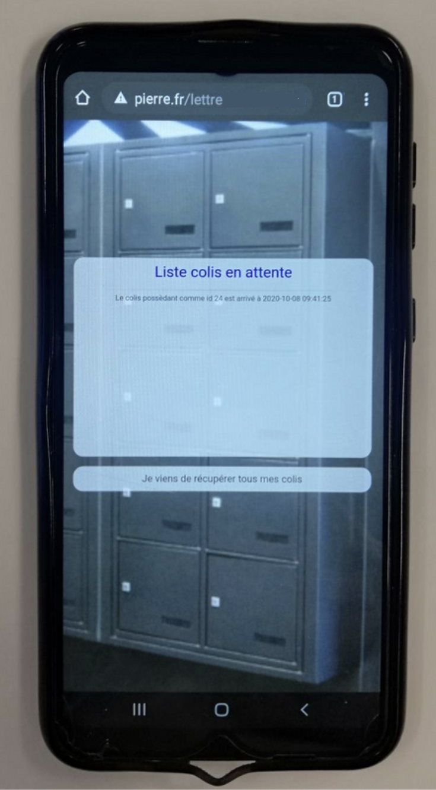

<h1 align="center">
  
</h1>
---

## Petit résumé

- S'il y a bien une chose qui a peu évolué dans nos logements, c'est notre utilisation de la boîte aux lettres. De nos jours, les habitudes se sont considérablement modifiées. Avec le développement du e-commerce, les colis sont de plus en plus nombreux et les gens toujours plus impatients à l'idée de les recevoir. Cependant ils ne vont pas patienter des heures devant leur boîte aux lettres... La solution c'est Lettric: une boite aux lettres connectée qui notifie son propriétaire dès que le colis est déposé dans celle-ci.

## Objectifs

- Stocker les colis.
- Prévenir l'utilisateur de l'arrivé des colis via un site web.

## Techno

- Arduino
- Mosquitto
- SQL
- HTML
- CSS

## HardWare

## Software

## Auteur

- [@Pierre](https://github.com/Pierre-Portfolio)
- [@Anthony](https://github.com/Cyd-des-Tenebres)
